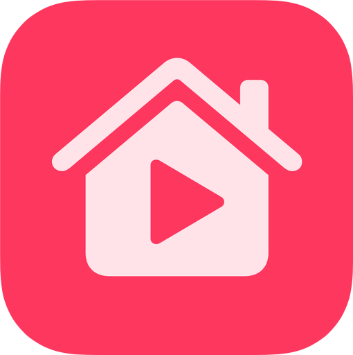
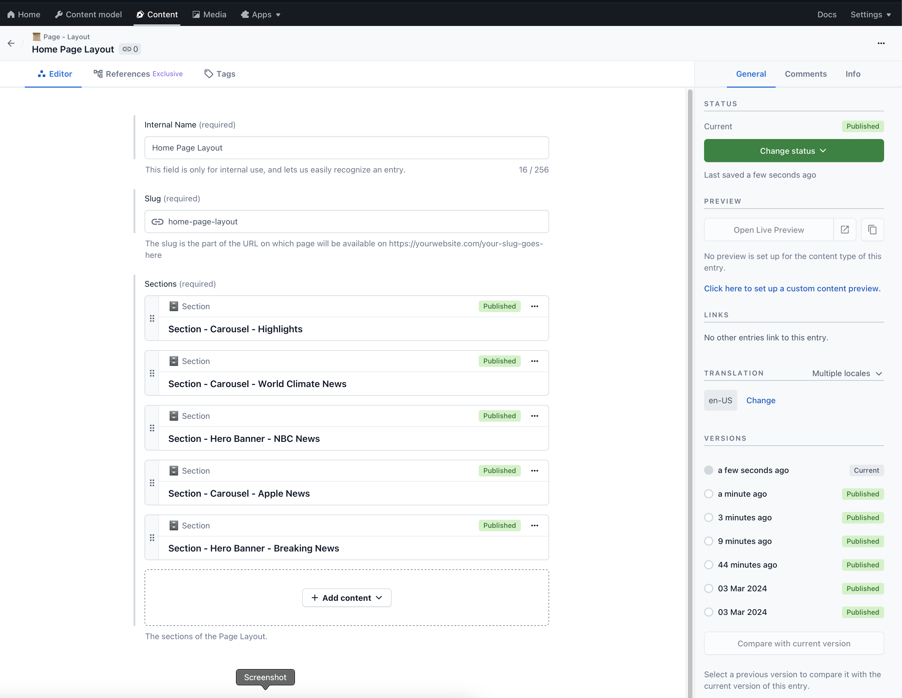
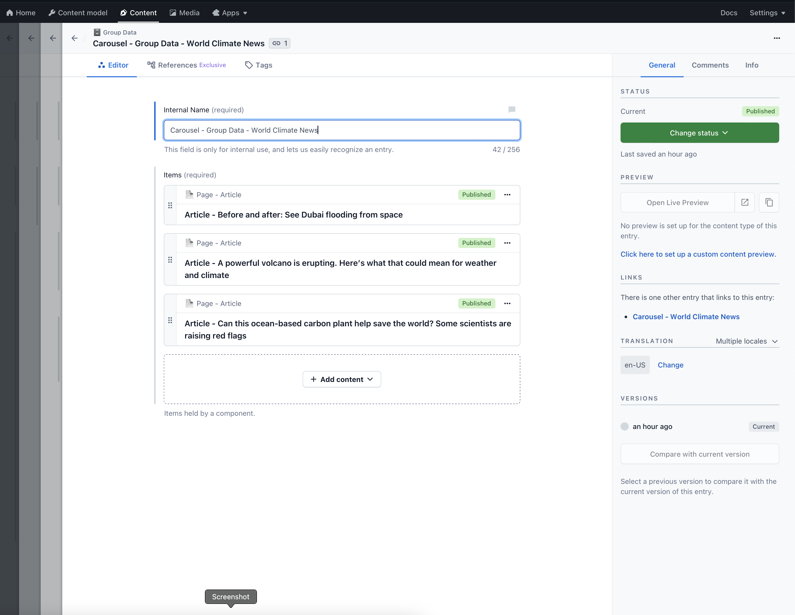

<!-- HEADER -->

<h1> Media App </h1>

[][Swift]
[][SwiftUI]
[][iOS]

<!-- BODY -->

## Preview

https://github.com/eduardc77/MediaApp/assets/36419167/73e0175d-8600-4c41-a3d2-069fc57b408d

	
	

## Description

This project aims to demonstrate how to implement CMS with SwiftUI and Contentful as well as an implementation and consumtion of a generic networking layer that can be used with any API call. 
Conentul enables to build your own custom mobile app backend. The 'home' tab screen consumes content from Cotnentful and dynamicaly builds the sections an components based on the 'Layout' content model created in the Contentful platform and every change is reflected in the app. 

This app was created for educational purposes and as a demonstration of SwiftUI and Contentful integration and the implementation of a generic networking layer.
The app is still work in progress.

## What is Contentful?

Contentful provides a content infrastructure for digital teams to power content in websites, apps, and devices. Unlike a CMS, Contentful was built to integrate with the modern software stack. It offers a central hub for structured content, powerful management and delivery APIs, and a customizable web app that enable developers and content creators to ship digital products faster.

## Built with:
- SwiftUI
- Combine
- Asynchronous (async/await) Functions
- [Contentful](https://github.com/contentful/contentful.swift/)

<!-- FOOTER -->
<!-- Permanent links -->
[Swift]: https://www.swift.org
[SwiftUI]: https://developer.apple.com/documentation/swiftui/
[iOS]: https://developer.apple.com/ios/
